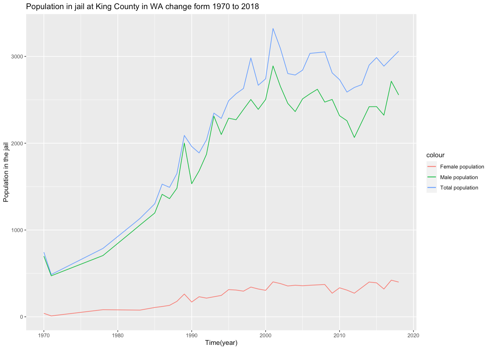
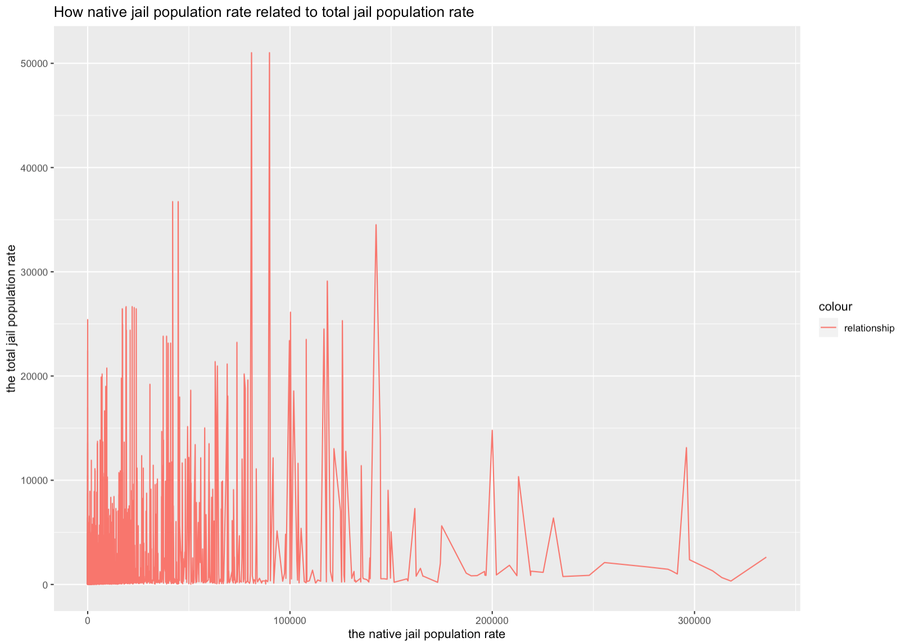
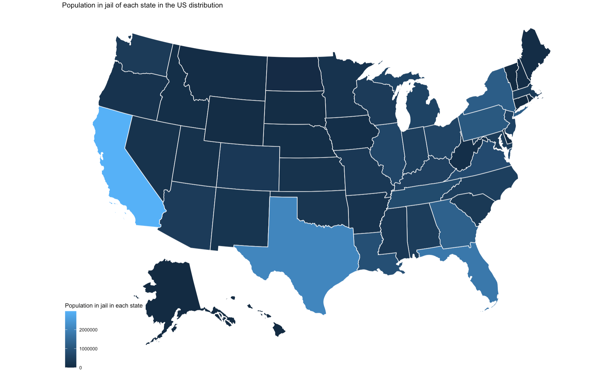

```{r setup, include=FALSE}
knitr::opts_chunk$set(echo = TRUE)
library(dplyr)
library(ggplot2)
library(usmap)
```
## Introduction
### Background of the analysis and data sets
For this assignment I explored the differences and changes in the prison population and the types of prison populations by state in the United States by analyzing a data set on population in jail and prison. The two data sets that I used are from Vera institute of justice. I download the data from "https://github.com/vera-institute/incarceration-trends#documentation". The first data set shows the population count and the type of population in jail in the US from 1970 to 2018. The second data set shows the prison data from 2019 to 2021. 

### How I analyze the data
I analyze the data sets by using R studio. I use dplyr for the values that I calculated.  
First, I analyzed for each race, in which state do they have the highest prison population. For example, for aapi, in 2017, they have the highest jail population in Washington than in other state.  
Second, I analyze the change of jail population from 2019 to 2021.  
Third, I analyze which state has the most male in jail in 2017.  
Then, I analyze which state has the most female in jail in 2017.  
For the last three values, I analyzed Which state has the least and most population in prison in 2019, 2020, and 2021.  

For each value, I create a data frame first to select the necessary data for the current value from the previous data sets. This could help me to manage the data better. Then I will use different functions in dplyr to calculate the data.

## Summary Information
### All results that I calculate from the data.
* Which state has the highest population of every races in jail in 2017:
  + For aapi, in 2017, they have the highest jail population in Washington than in other state.
  + For black, in 2017, they have the highest jail population in Florida than in other state.
  + For Latinx, in 2017, they have the highest jail population in Florida than in other state.
  + For native, in 2017, they have the highest jail population in Oklahoma than in other state.
  + For white, in 2017, they have the highest jail population in Florida than in other state.
* Which is the change of population in prison from 2019 to 2021?
  + -235451
* Which state has the most male in jail in 2017?
  + California
* Which state has the most female in jail in 2017?
  + California
* Which state has the least and most population in prison in 2019?
  + Most: Texas
  + Least: Vermont
* Which state has the least and most population in prison in 2020?
  + Most: Texas
  + Least: Vermont
* Which state has the least and most population in prison in 2021?
  + Most: Texas
  + Least: Vermont

## Plot shows trends over time
For this plot, I use the data about total population in jail from 1970 to 2018, male population in jail from 1970 to 2018, and female population in jail from 1970 to 2018. And I use the data are only from King County in WA. I did not just use the value that I calculate previously about male and female population from 2019 to 2021 because I think only three years are not enough to see a trend. Also, I use a specific area because this is more close to our life at UW.  

This plot clearly shows that at King County, from 1970 to 2021, male have much more population in jail than female. Also, the trend of male are more similar to the trend of total population. This means male population in jail affects the total population in jail more at King County.



## Plot compares how the native_jail_pop_rate related to total_jail_pop_rate
This plot shows how the native jail population rated related to total jail population rate. From the plot, we can see that there is no specific pattern here that shows a clearly relationship between these two variables. Which means the relationship is strongly affected by other races' jail population rate.


## Map that shows population in jail in each state
This map shows how many jail population every state have. The darker means there are less jail population here. And the lighter color shows that there are more jail population in the states.
I shows this map since readers could clearly see which state has more or less jail population.

